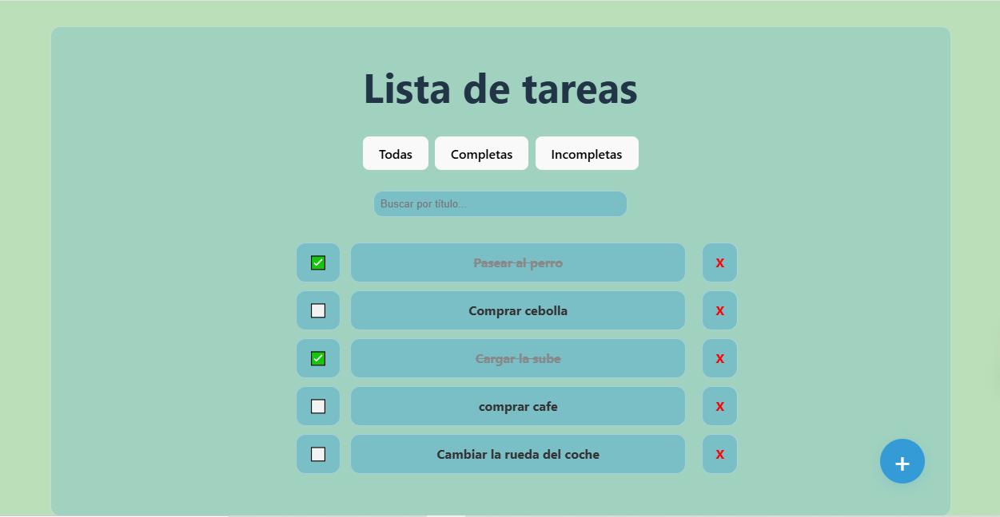
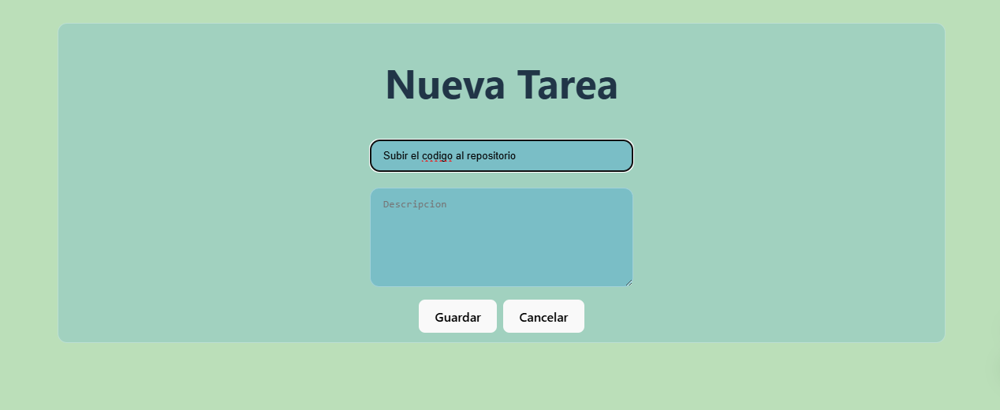
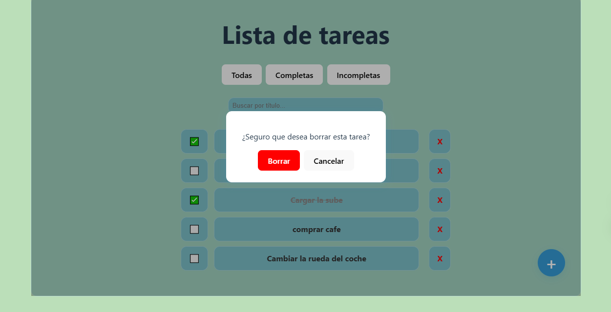

# 📝 TaskList - Aplicación de Lista de Tareas

Una aplicación simple para gestionar tareas diarias. Está construida con **React**, **TailwindCSS** y **Vite** en el frontend, y **Node.js + SQLite** en el backend. Permite agregar, editar y eliminar tareas con una interfaz ágil y moderna.

## 📸 Capturas de pantalla

- Pantalla principal:
   
- Agregar tarea:
  
- Borrar tarea:
   
 

## 🚀 Ejecución local

### ⚙️ Requisitos

- Node.js 18 o superior  
- npm

### 🧱 Backend (API con SQLite)

```bash
cd backend
npm install
node index.js
```

El backend quedará disponible en: `http://localhost:3001`

### 🎨 Frontend (React + Tailwind + Vite)

```bash
cd frontend/tasklist
npm install
npm run dev
```

El frontend estará disponible en la URL indicada por la terminal (por defecto `http://localhost:5173`)

## 📚 Uso

Abrí la URL del frontend en tu navegador.  
La aplicación se conecta automáticamente al backend en `http://localhost:3001`.

## 🔍 Nota

- Si hay problemas con la base de datos, revisá que el archivo `tasks.db` se haya creado correctamente en la carpeta del backend.  
- Si usás otro puerto en el backend, ajustá la configuración del frontend para que apunte a la URL correcta.
